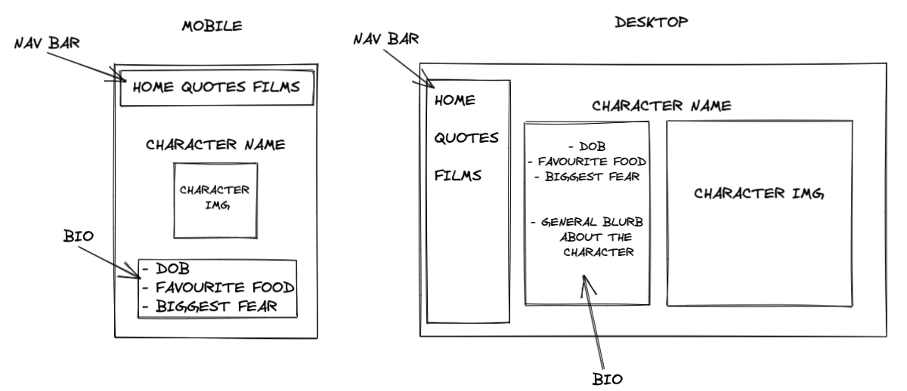

# HTML & CSS Precourse

Welcome to the HTML and CSS section of the precourse!

Now that you have completed `precourse-javascript` it's important you dedicate as much time as you can to developing your HTML and CSS skills. You need to have some familiarity with them if you are to work in web development. It will also make portfolio pieces you show to companies stand out, regardless of which stack or language you ultimately use. While we look at HTML and CSS during the course, it isn't covered in detail like we teach JavaScript and you will largely be reliant on your own research and self-learning.

Treat this repo as an ongoing project, there is never a limit to what you can learn with HTML/CSS. Any practice you put in will benefit you in the long run.

Please follow this README in order. The HTML & CSS Precourse contains a mixture of videos, reading material, tools and challenges.  
To help, we have marked out these sections using emojis:

- 📖 : Read.
- 📹 : Watch.
- 💻 : Code.
- 🔧 : Tool.

Before you go any further, `fork and clone this repository`.
That way you can make use of [CHECKLIST.md](CHECKLIST.md), in the root of this repo. Use this file to keep track of the tasks you have completed!

_HINT: As with Precourse-JavaScript, this README is best viewed with `Open Preview` if you right click on the file!_ 

---

## 1. HTML & CSS Basics

If you've no experience with these technologies, please follow these courses on HTML and CSS:

- 💻 - [Codecademy learn HTML](https://www.codecademy.com/learn/learn-html)  
- 💻 - [Codecademy learn CSS](https://www.codecademy.com/learn/learn-css)  

The Codecademy courses give a good overview of HTML and CSS, but if you want some extra practice or prefer the format of FreeCodeCamp, try:  

- 💻 - [FreeCodeCamp HTML/CSS material](https://www.freecodecamp.org/learn/responsive-web-design/)

One of the most important things to understand about HTML and CSS is the Box Model.

- 📹 - [This video](https://www.youtube.com/watch?v=9z0LjM4cM0o) explains the Box Model pretty well.

There are loads of great HTML and CSS resources online, but the sheer volume of elements, attributes and styles to learn means that it can take a while until it sinks in.

📖 - Here are a couple of reference guides and cheatsheets that are worth a bookmark:

- We like [this book](http://wtf.tw/ref/duckett.pdf), it's a long read so feel free to have a look in your own time!

- Some good HTML5 cheatsheets are available [here](https://websitesetup.org/html5-cheat-sheet/)

- A handy CSS cheatsheet from the same website [here](https://websitesetup.org/css3-cheat-sheet/)

- A great place to try out anything like this is [Codepen](https://codepen.io/). You can make your own stuff ('pens'), but have a look at what other people are up to too - great for inspiration.

---

## 2. Responsive Design

Nowadays most visits to websites are made on mobile and tablet devices. This means people are viewing sites on a range of different screen sizes, and we need to make sure our site looks attractive and provides a good user experience across all devices. Responsive design is the process of designing and building our sites with this in mind. There are a few concepts and features in CSS that you should get to know to help with this:

💻 - _Practice your skills in codepen with the following concepts_

**Relative Units**

Relative length units are relative to something else, perhaps the size of the parent element's font, or the size of the viewport (the user's visible area of a web page). The benefit of using relative units is that with some careful planning you can make it so the size of text or other elements scales relative to everything else on the page.

- 📖 - [Here is a great guide](https://hackernoon.com/the-best-css-unit-for-a-responsive-design-ku6q37to) explaining the different types of relative units we can use when considering responsive design.
- 📖 - Also [this guide](https://web.dev/learn/css/sizing/) gives an overview of all available units in CSS, both absolute and relative.

**Media Queries**

Media queries allow us to specify particular styling to be applied at specific ranges of screen sizes, giving us extra control over where we position things and how we size elements and typefaces on different sized devices.

- 📹 - Here is a short video by [Kevin Powell](https://www.youtube.com/watch?v=2KL-z9A56SQ) on how to use them.
- 📖 - Also read this [CSS Tricks Guide to Media Queries](https://css-tricks.com/css-media-queries/).

**Flexbox**

The flexbox layout model has been around since the early 2010s, and was created with responsiveness in mind. It is very commonly used now to handle alignment across one direction, and is worth getting on top of.

- 📖 - The [MDN basic concepts walkthrough](https://developer.mozilla.org/en-US/docs/Web/CSS/CSS_Flexible_Box_Layout/Basic_Concepts_of_Flexbox) is an excellent introduction.
- 📖 - This [CSS Tricks guide](https://css-tricks.com/snippets/css/a-guide-to-flexbox/) is a great reference.
- 💻 - Spend some time on these two fun flexbox games: [Flexbox Froggy](https://flexboxfroggy.com/) and [Flexbox Zombies](https://flexboxzombies.com/p/flexbox-zombies).
- 💻 - Use [Flexy Boxes](https://the-echoplex.net/flexyboxes/) to flex your own flexbox muscles 💪🏽 Try out your ideas and see how it works on the screen.

**CSS Grid**

Finally, the newish kid on the block is CSS grid. It has been supported on all major browsers since the end of 2017, and is becoming more and more widely implemented. Whereas flexbox is focused on handling elements across one dimension, you can think of CSS Grid as a mapping tool across two dimensions.

- 📖 - The guide on [MDN](https://developer.mozilla.org/en-US/docs/Web/CSS/CSS_Grid_Layout/Basic_Concepts_of_Grid_Layout) is again a great introduction.
- 📖 - [CSS Tricks](https://css-tricks.com/snippets/css/complete-guide-grid/) for a visually appealing guide.
- 💻 - [Grid Garden](http://cssgridgarden.com/) is a fun introductory game too.

---

## 3. Accessibility

Accessibility, commonly referred to as `a11y` in the tech world, refers to making tech available to as many people as possible. As developers we must subscribe to aims and legal imperatives when creating a product, ensuring that regardless of any disability or impairment, content can be accessed.

- 📖 - [W3C](https://www.w3.org/standards/webdesign/accessibility) has a great overview on accessibility.

One thing you can do from the start is ensure you are using `semantic HTML` - or the right element for the right occasion. For example, a `
` tag represents a **p**aragraph, so that's what it should be used for. This has implications not only for those who read your code, but for screen readers and SEO optimisation amongst other aspects.

- 📖 - Here's a [friendly, but comprehensive tutorial](https://www.internetingishard.com/html-and-css/semantic-html/) on using semantic HTML.
- 📖 - For information about how screen readers work, check out [this article](https://accessibility.its.uconn.edu/2018/08/22/what-is-a-screen-reader-and-how-does-it-work/) which also has a handy video attached.
- 📖 - Read [Writing HTML Code for Screen Readers: 6 Best Practices](https://www.optasy.com/blog/writing-html-code-screen-readers-6-best-practices) for hints and tips on how to improve your code for the purpose of screen readers.
- 📖 - How semantic elements can help with [SEO optimisation](https://www.inboundnow.com/html5-semantic-elements-mean-seo/)

We as developers thankfully have access to some very helpful tools that can highlight accessibility on our websites. These will give you some detailed feedback on accessibility issues your website might have - try using it on some popular websites and see where they fall short!

- 🔧 - [Axe](https://www.deque.com/axe/) is available as an extension on [Chrome](https://chrome.google.com/webstore/detail/axe/lhdoppojpmngadmnindnejefpokejbdd) and [Firefox](https://addons.mozilla.org/en-US/firefox/addon/axe-devtools/)
- 🔧 - [Lighthouse](https://developers.google.com/web/tools/lighthouse) is a popular extension made by Google.
- 🔧 - [WAVE](https://wave.webaim.org/) is another option that can be used on Firefox and Chrome

Do these tools pick up the same issues as each other? Try them out for yourself!

---

## 4. Building Your Project

For this section's challenge, you need to demonstrate your HTML and CSS skills by building a project. You should show your ability to set up a project from scratch, linking the necessary CSS files and images. It should be...

- **responsive** - it should be functional at different screen sizes.
- **accessible** - it should employ good practices for those using alternative means to access the website, i.e. screen readers.
- **readable** - it should be readable, not least for potential employers who might want to view the source code of your site.
- **attractive** - it should look good!

### 4.1 Project Ideas 💡

_Taking the above into account, choose one of the following for your project or use an idea of your own._

**A. Portfolio Site** 📂

Create a portfolio site that you can take away and perhaps publicise at the end of the course, with links to the projects you've created. It should have...

- a home/about page
- a portfolio list with links
- contact details

...across multiple pages with internal links.

**B. Profile Site** 🦹

Create a profile of a character of your choosing (or even yourself).

It should have...

- an "About me" section for the character
- an image of the character
- at least one more page with further information
- external links

...across multiple pages with internal links.

**C. Website Clone** 🐑

A popular way of getting to grips with HTML/CSS is to try and clone a current website yourself. It can help if you're struggling for inspiration and is a great way of testing yourself.

Try to make a copy of your favourite website as best you can! The website can be as 'basic' or as complex as you like. We would suggest that you choose a website that at least has a range of colours on it and different sections to configure. Also check how the website you want to clone looks like on both desktop and mobile!

_If none of the above ideas tickle your fancy, [FreeCodeCamp](https://www.freecodecamp.org/learn/responsive-web-design/#responsive-web-design-projects) has some suggestions too!_

### 4.2 Plan 🎨

Have you ever tried to build IKEA furniture without following the guide? We've all been there and before you know it you've built a desk instead of a bookcase...

Planning your project is essential, not only will it give you a visual respresentation that you can refer back to but it will help to get your thoughts and ideas down.

🔧 Here are some websites we love for planning -

- [Excalidraw](https://excalidraw.com/) - A very simple, easy to use drawing tool.
- [tldraw](https://tldraw.com) - Same as above, totally free and easy to get to grips with.
- [Figma](https://figma.com) - A bit more in-depth, sign up required but a free account gets you everything you need!
- [Canva](https://canva.com) - Another in-depth option.

You should plan out a design for each page that your project needs. You should also consider how your project is going to look in both desktop and mobile view. Maybe the layout of your page is going to change with the help of media queries?

See below for an example on drawing up designs for a profile site -

_If you haven't already, right click on this file and select `Open Preview` to view the below image in VSCode!_ 

As you can see both mobile and desktop view have been considered here, with different designs for both. You should do similar for each page you intend to create! 

Your plan could be more detailed. Consider what HTML element your nav bar would be, or whether your bio section would be created using an ordered or unordered list!

### 4.3 Code 💻

1. Before you start any work on your project please watch the following videos:

   📹 - [Starting a Portfolio page](https://northcoders.wistia.com/medias/uqp2vm4czm)  
     _The above video focuses on creating a portfolio, but it is a good guide for any project you want to start!_
   📹 - [Links, images and additional HTML](https://northcoders.wistia.com/medias/9orakqv2h6)

2. Create your own GitHub repo for this task. Clone it to your computer.
3. Create a structure inside this folder to hold your website assets.  
   📖 - _There's a guide on how to do this on [MDN](https://developer.mozilla.org/en-US/docs/Learn/Getting_started_with_the_web/Dealing_with_files)._
4. Build your site! We suggest starting with the basic HTML structure, then bringing in CSS and any other JavaScript when you are happy with the content.
5. In [CHECKLIST.md](CHECKLIST.md) under the `Project` section wtihin `4.Building Your Project` we have provided you with a list of HTML elements and CSS properties you should aspire to include in your project. Check these out for inspiration!
6. Remember to add and commit your changes frequently as you work.
7. When you're ready to show the world, you might want to look at [GitHub Pages](https://pages.github.com/) as a solution for deploying.

---

## Other Resources 🔧

- [fontawesome.io](http://fontawesome.io/) for icons.
- [devicon](https://devicon.dev/) for some lovely tech icons in particular.
- [google fonts](https://fonts.google.com/) for easily implementable fonts.
- [coolors](http://coolors.co/) for some great colour palette suggestions.
- [css cheatsheet](https://htmlcheatsheet.com/css/) and [html cheatsheet](https://htmlcheatsheet.com/), a feast for the eyes.
- unique [lorem ipsum generators](https://www.shopify.co.uk/partners/blog/79940998-15-funny-lorem-ipsum-generators-to-shake-up-your-design-mockups) for filler text with a twist.
- [mycolor.space](https://mycolor.space/) for creating your own colour palettes from a single hex colour.

This list is not exhaustive and just a small selection of handy websites. If you have any suggestions that could be added to this list we would love to hear about them!

---

## Advanced CSS

You should get used to the syntax and limitations of vanilla CSS. In the 'real world', however, many developers use a CSS pre-processor. This is essentially an extra step in interpreting the CSS - it can be written in a different format, which is then processed into regular CSS that browsers can understand. This [article](https://htmlmag.com/article/an-introduction-to-css-preprocessors-sass-less-stylus) is a great demonstration of how three of the most common CSS pre-processors (SASS, LESS and Stylus) give you more freedom with CSS.

Another consideration on larger projects is adopting a naming convention for your CSS classes that is readable and flexible. You might not be doing something on a scale where you reap the benefits, but this would be a good opportunity to explore good practices: consider implementing the [BEM syntax](http://getbem.com/introduction/) in your page.

---

## Feedback

At Northcoders we strive to make regular improvements to all of our content, whether that's to keep up with updates in tech or through good old fashioned feedback!

We love feedback! So please, if you could spare 2 minutes of your time to fill out the typeform below, we would really appreciate it. Your thoughts will help make this material the best it can be. 

This typeform would be filled out anonymously so feel free to be as constructive as you like 🙂 

[https://northcoders.typeform.com/to/jg58HDCP](https://northcoders.typeform.com/to/jg58HDCP)